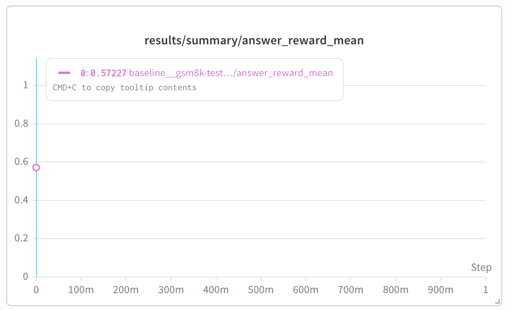
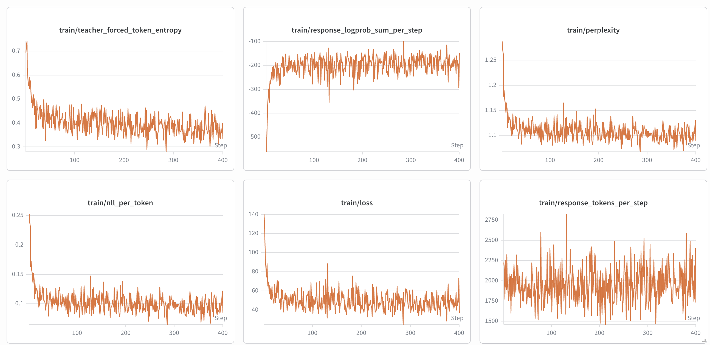
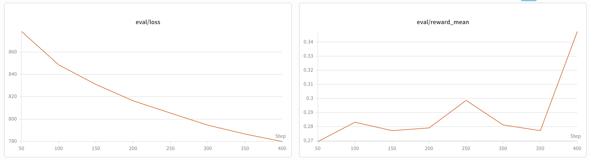
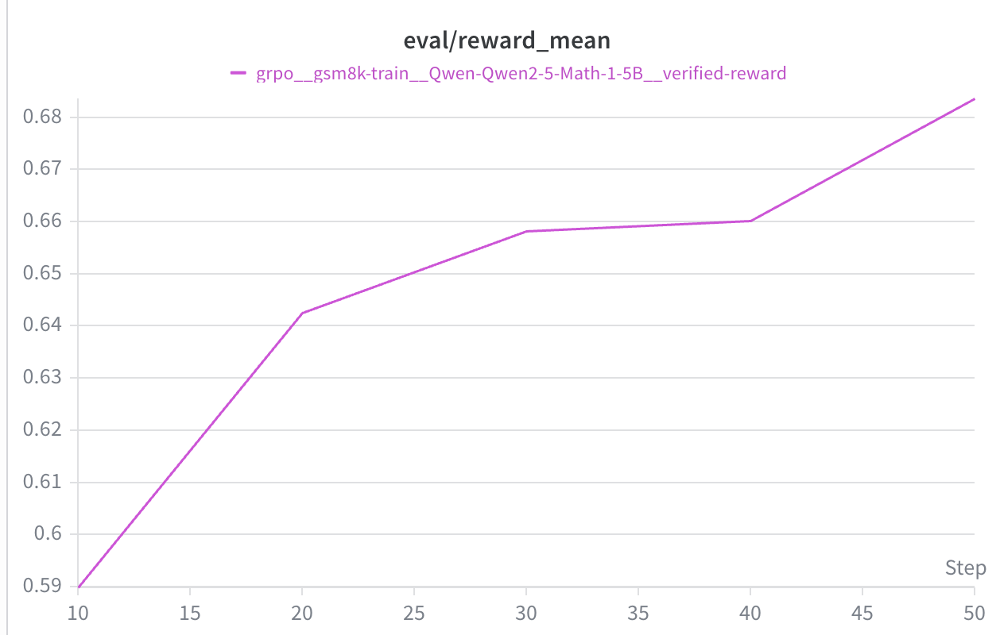

# GSM8K Alignment Experiments

This repository contains my alignment experiments on GSM8K, inspired by the CS336 Assignment 5 alignment task.
The core training code lives under [`cs336_alignment/`](./cs336_alignment), and the
end-to-end experiment workflow is documented in
[`notebooks/sft_grpo_on_gsm8k_qwen2.5_math_1.5b.ipynb`](./notebooks/sft_grpo_on_gsm8k_qwen2.5_math_1.5b.ipynb).

I also ran the notebook on Colab and tracked the experiments in Weights & Biases:

- Colab notebook: <https://colab.research.google.com/drive/1WA5OMfAWSqJRAll4Y_imFLXMhp9mko48?usp=sharing>
- W&B workspace: <https://wandb.ai/chenrui6/cs336-assignment5-alignment/workspace?nw=nwuserchenruiliu66>

## What’s Included

The project includes:

- **SFT** in [`cs336_alignment/sft.py`](./cs336_alignment/sft.py)
- **GRPO** in [`cs336_alignment/grpo.py`](./cs336_alignment/grpo.py)
- supporting data, metrics, evaluation, checkpointing, and vLLM utilities in [`cs336_alignment/`](./cs336_alignment)
- a reproducible Colab notebook in [`notebooks/`](./notebooks) that runs:
  - a zero-shot GSM8K baseline
  - SFT with reasoning traces
  - GRPO with verified rewards

To make the training runs fit on limited GPU memory, I used **gradient accumulation** to increase the effective batch size while running on a single Colab A100.

## Results Summary

The plots below summarize the main observations from the notebook runs.

### Baseline

The zero-shot baseline on GSM8K reaches an answer reward mean of about **0.572**.

### SFT

SFT shows a clear drop in training loss, but the evaluation accuracy/reward is not as strong as the zero-shot baseline. In other words, optimization improved the training objective, but that did not translate into better GSM8K evaluation performance.

### GRPO

GRPO improves evaluation reward more consistently. By **step 50**, the eval reward is around **0.68**, and the curve does not show an obvious plateau or overfitting signal in the logged run.

## Setup

If you are using the Colab notebook, the notebook handles environment setup and dependency installation for you.

## References

- CS336 Assignment 5 alignment repo: <https://github.com/stanford-cs336/assignment5-alignment>
